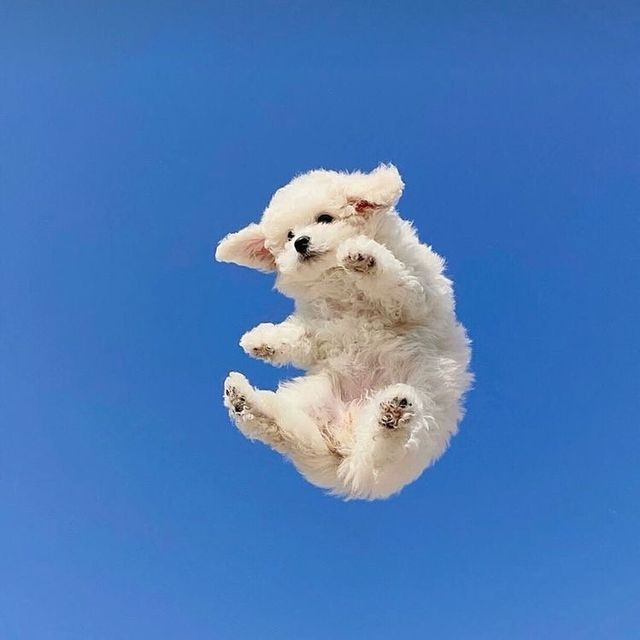
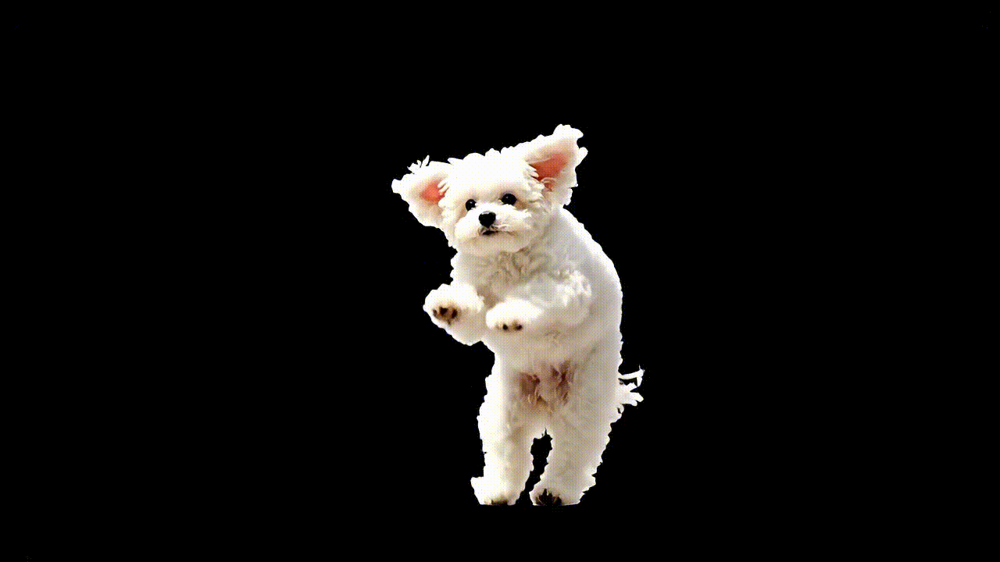

# AI 4-Sided 3D Hologram Project
**(Web + Hardware Integrated Project)**  
이미지 업로드 → AI 처리 → 사방면 홀로그램 영상 생성 → 디바이스 재생

---

## 📌 Overview

이 프로젝트는 **AI 기반 영상 생성 시스템(Web)**과  
직접 제작한 **4방면 아크릴 홀로그램 디바이스(Hardware)**를 하나로 통합한  
엔드-투-엔드 홀로그램 생성 프로젝트입니다.

사용자는 웹에서 이미지를 업로드하면  
AI가 자동으로 **배경을 제거**하고, **움직이는 애니메이션 영상**으로 변환하며,  
이를 **사방면(Front/Back/Left/Right) 홀로그램 구조**에 맞게 자동 배치합니다.

최종 출력된 영상은 태블릿·스마트폰 화면에서 재생되며,  
직접 제작한 **45° 아크릴 피라미드 홀로그램 장치**를 통해  
공중에 떠 있는 듯한 가상 3D 홀로그램 효과를 제공합니다.

이 프로젝트는 **AI · 영상 처리 · 웹 서비스 · 디지털 제작 · 광학 원리**가 결합된  
종합적인 제품 제작 프로젝트입니다.

---

## 🎥 데모

### 웹 인터페이스


### 원본 사진


#### 움직이는 영상으로 변환된 결과


#### 사방면 영상으로 변환된 결과


#### 실제 디바이스 홀로그램 데모 영상

---

## 🎯 Project Goals

- 정적 이미지를 AI로 동적 홀로그램 콘텐츠로 변환  
- 누구나 쉽게 사용할 수 있는 웹 기반 영상 생성 도구 제작  
- 아크릴을 이용한 물리적 홀로그램 디바이스 설계 및 제작  
- 소프트웨어 + 하드웨어가 완전히 연결된 **제품형 시스템 구현**  
- Pepper’s Ghost 원리에 기반한 홀로그램 경험 최적화  

---

# 🧩 Project Architecture
[User Image Upload]
↓
(rembg on Replicate)
Background Removal
↓
(veo-3-fast on Replicate)
Animation Generation
↓
Hologram Layout Builder
(4-Sided Cross Layout)
↓
MP4 Export
↓
Smart Device (Tablet/Phone)
↓
45° Acrylic Hologram Pyramid
↓
✨ Floating 3D Image
---

# 🛠 Components

## 1) Web Platform (Software)

### 기능
- 📸 이미지 업로드 (드래그 앤 드롭 지원)
- 🎨 AI 배경 제거 (Replicate API)
- 🎬 AI 애니메이션 변환 (Veo-3-Fast on Replicate)
- 🎭 4방면 홀로그램 뷰어 (상/하/좌/우 자동 배치)
- 📱 기기 프리셋 지원 (iPad Air 11 등)
- 🔄 실시간 처리 상태 표시
- 🎚️ 영상 크기 조절 기능

### 기술 스택
- **Frontend:** Next.js 14.2.3 (App Router) / React 18.3.1 / TypeScript  
- **Backend:** Next.js API Routes  
- **AI Pipeline:** [Replicate](https://replicate.com) API
  - 배경 제거: `rembg` 모델 ([cjwbw/rembg on Replicate](https://replicate.com/cjwbw/rembg))
  - 영상 생성: `veo-3-fast` 모델 ([google/veo-3-fast on Replicate](https://replicate.com/google/veo-3-fast))
- **Storage:** Supabase Storage
- **라이브러리:**
  - `@supabase/supabase-js`: Supabase 클라이언트
  - `exif-js`: 이미지 EXIF 데이터 처리 (회전 정보 정규화)  

---

## 2) Hologram Device (Hardware)

### 구성
- 투명 아크릴 4면 피라미드 구조  
- 각 면 45° 기울기  
- 스마트폰 혹은 태블릿 화면 위에 배치  

### 이유
- 45°는 **입사각 = 반사각** 원리에 따라  
  화면의 빛이 사용자 시야로 가장 자연스럽게 반사되는 구조  
- 4방면은 인간이 관찰 가능한 수평 360° 시야를 재현하는 최적 구조  

### 홀로그램 생성 방식  
- 4방면 영상이 각 아크릴 면에 반사됨  
- 반사된 영상이 중심점에 결합되어 **가상 영상(virtual image)** 형성  
- 사용자는 공중에 떠 있는 것처럼 보게 됨  

---

# 🧠 Scientific Principle

## ✔ Pepper’s Ghost Illusion  
본 프로젝트는 레이저 간섭 기반의 진짜 홀로그래피가 아닌  
**반사 기반 착시 효과**로 홀로그램을 구현함.

### 핵심 물리 원리
- **정반사 (Specular Reflection)**  
- **입사각 = 반사각**  
- **가상 영상 형성(Virtual Image)**  
- 굴절/회절은 보조적 역할만 수행  

---

# 🎬 Hologram Content Generation (AI Pipeline)

## 1) Background Removal
**모델:** `rembg` ([cjwbw/rembg on Replicate](https://replicate.com/cjwbw/rembg))

- 실제 대상만 분리하여 홀로그램 최적화
- 투명 배경 PNG 형식으로 출력
- Replicate API를 통해 비동기 처리

## 2) Animation Synthesis
**모델:** `veo-3-fast` ([google/veo-3-fast on Replicate](https://replicate.com/google/veo-3-fast))

- 이미지 → 움직이는 루프 애니메이션 변환
- **설정:**
  - 길이: 4초
  - 해상도: 720p
  - 비율: 16:9
  - 배경: 순수 검정 (#000000)
- **애니메이션 특징:**
  - 미세한 좌우 패럴랙스(parallax) 효과
  - 작은 틸트(tilt)로 깊이감 구현
  - 순환 가능한 루프 애니메이션
  - 주체는 중심에 보존, 회전 없음
  - 그림자, 반사, 파티클 없음  

## 3) 4-Sided Transformation  
AI가 만든 애니메이션을 기반으로 웹에서 실시간으로 4방면 변환:

- **상 (Top)**: 180° 회전
- **하 (Bottom)**: 0° (원본)
- **좌 (Left)**: 90° 회전
- **우 (Right)**: 270° 회전

## 4) Cross Layout Assembly  
웹 뷰어에서 표준 홀로그램 출력용 십자 레이아웃으로 자동 배치:
```
        [상: 180°]
[좌: 90°]  [검정]  [우: 270°]
        [하: 0°]
```

각 방향의 영상이 동시에 재생되어 홀로그램 피라미드 디바이스에서 3D 효과를 구현합니다.

        ---

# 📐 Acrylic Hologram Pyramid Design

### 기본 도면 (예시: iPad Air 11)
- Bottom width: 120mm  
- Top width: 0–5mm  
- Height: 60mm  
- Angle: 45°  

---

# 📦 Folder Structure
```
3d_hologram_web/
├── app/
│   ├── api/
│   │   ├── create-hologram-video/  # 홀로그램 영상 생성 API
│   │   │   └── route.ts
│   │   └── remove-background/      # 배경 제거 API
│   │       └── route.ts
│   ├── globals.css                 # 전역 스타일
│   ├── layout.tsx                  # 루트 레이아웃
│   └── page.tsx                    # 메인 페이지 (홀로그램 뷰어 포함)
├── demonstration_video/             # 데모 이미지 및 영상 (Git에 포함)
│   ├── IMG_4531.JPG               # 홀로그램 디바이스 사진
│   └── ...
├── lib/
│   └── supabaseClient.ts          # Supabase 클라이언트 설정
├── package.json
├── tsconfig.json
└── README.md
```

---

# ▶️ How to Run

## 필수 요구사항

- Node.js 18 이상
- npm 또는 yarn
- Supabase 프로젝트
- Replicate API 계정

## 설치 및 실행

### 1. 저장소 클론 및 의존성 설치
```bash
git clone <repository-url>
cd 3d_hologram_web
npm install
```

### 2. 환경 변수 설정

프로젝트 루트에 `.env.local` 파일을 생성하고 다음 변수들을 설정하세요:

```env
# Supabase 설정
NEXT_PUBLIC_SUPABASE_URL=your_supabase_project_url
NEXT_PUBLIC_SUPABASE_ANON_KEY=your_supabase_anon_key

# Replicate API 설정
REPLICATE_API_TOKEN=your_replicate_api_token
REPLICATE_REMBG_VERSION=your_rembg_model_version_id
```

#### 환경 변수 설정 방법

**Supabase 설정:**
1. [Supabase](https://supabase.com)에서 프로젝트 생성
2. 프로젝트 설정 → API에서 URL과 anon key 복사
3. Storage에서 `3D_hologram_images` 버킷 생성 (public 권한 필요)
4. 버킷 내부에 다음 폴더 구조 생성:
   - `user_images/` - 업로드된 원본 이미지
   - `removed_backgrounds/` - 배경 제거된 이미지
   - `veo_video/` - 생성된 홀로그램 영상

**Replicate API 설정:**
1. [Replicate](https://replicate.com)에서 계정 생성
2. API 토큰 생성: [Account Settings → API Tokens](https://replicate.com/account/api-tokens)
3. 배경 제거 모델 버전 ID 확인:
   - [cjwbw/rembg 모델 페이지](https://replicate.com/cjwbw/rembg) 방문
   - API 탭에서 최신 버전 ID 복사 (예: `a295a834-9a12-4c58-8d8d-0c07f3681c07`)
   - `.env.local`의 `REPLICATE_REMBG_VERSION`에 설정

### 3. 개발 서버 실행
```bash
npm run dev
```

브라우저에서 [http://localhost:3000](http://localhost:3000)을 열어 확인하세요.

### 4. 프로덕션 빌드
```bash
npm run build
npm start
```

---

## 🎮 사용 방법

1. **이미지 업로드**
   - 메인 화면에서 이미지를 드래그 앤 드롭하거나 클릭하여 선택
   - 이미지는 자동으로 Supabase Storage에 업로드됩니다
   - EXIF 데이터를 읽어 이미지 회전 정보를 자동으로 정규화합니다

2. **홀로그램 영상 생성**
   - "3D 홀로그램 영상 만들기" 버튼 클릭
   - 배경 제거 → 영상 생성 과정이 자동으로 진행됩니다
   - 처리 시간은 약 1-4분 정도 소요될 수 있습니다

3. **홀로그램 뷰어**
   - 영상 생성 완료 후 자동으로 홀로그램 뷰어 화면으로 전환됩니다
   - 4방면으로 회전된 영상이 동시에 재생됩니다
   - 우측 상단의 슬라이더로 영상 크기 조절 가능 (0.5x ~ 2.0x)
   - "← 뒤로가기" 버튼으로 메인 화면으로 돌아갈 수 있습니다

---

## 🔧 API 엔드포인트

### POST `/api/remove-background`

배경 제거 API

**요청:**
```json
{
  "imageUrl": "https://..."
}
```

**응답:**
```json
{
  "success": true,
  "imageUrl": "https://...",
  "fileName": "1.png",
  "filePath": "removed_backgrounds/1.png"
}
```

### POST `/api/create-hologram-video`

홀로그램 영상 생성 API

**요청:**
```json
{
  "imageUrl": "https://...",
  "prompt": "Create a short video..."
}
```

**응답:**
```json
{
  "success": true,
  "videoUrl": "https://...",
  "fileName": "1.mp4",
  "filePath": "veo_video/1.mp4"
}
```

---

## 🐛 문제 해결

### 환경 변수 오류
- `.env.local` 파일이 프로젝트 루트에 있는지 확인
- 모든 필수 환경 변수가 설정되어 있는지 확인
- Supabase와 Replicate API 키가 유효한지 확인

### 이미지 업로드 실패
- Supabase Storage 버킷이 올바르게 생성되었는지 확인
- 버킷의 public 권한이 설정되어 있는지 확인
- 네트워크 연결 상태 확인

### 영상 생성 실패
- Replicate API 토큰이 유효한지 확인
- Replicate 계정에 충분한 크레딧이 있는지 확인
- API 요청 한도 초과 여부 확인

---

## 📝 주요 구현 사항

### 이미지 Orientation 정규화
EXIF 데이터를 읽어 이미지의 회전 정보를 자동으로 정규화합니다. 카메라로 촬영한 사진이 올바른 방향으로 표시되도록 보장합니다.

### 4방면 홀로그램 뷰어
생성된 영상을 상(180°), 하(0°), 좌(90°), 우(270°) 4방향으로 회전시켜 동시에 재생합니다. 이를 통해 3D 홀로그램 피라미드 디스플레이에서 입체적인 홀로그램 효과를 구현할 수 있습니다.

### 실시간 처리 상태 표시
배경 제거 및 영상 생성 과정을 실시간으로 표시하여 사용자 경험을 향상시킵니다.

---

## 📄 라이선스

이 프로젝트는 개인 프로젝트입니다.

## 🤝 기여